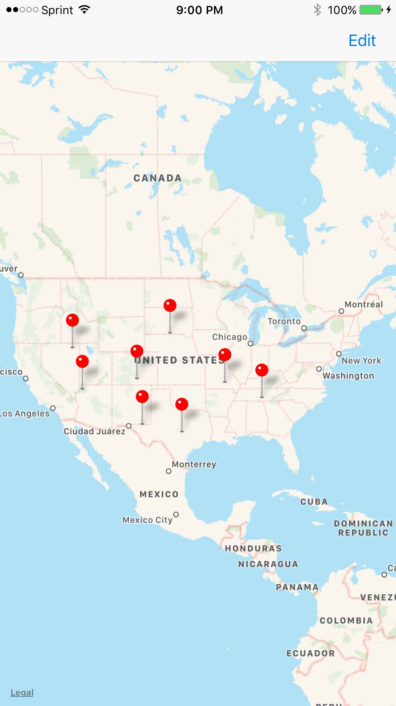
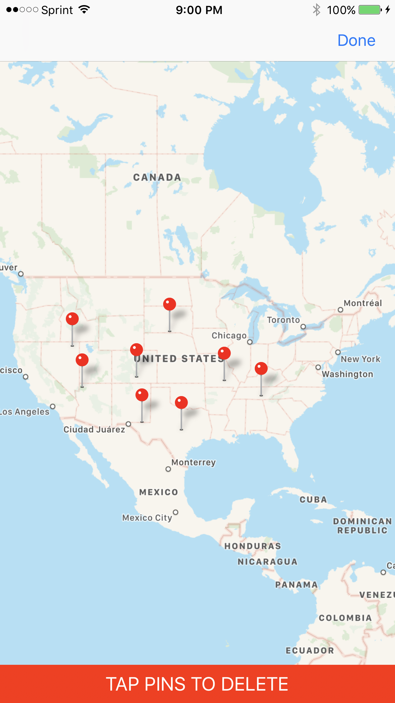
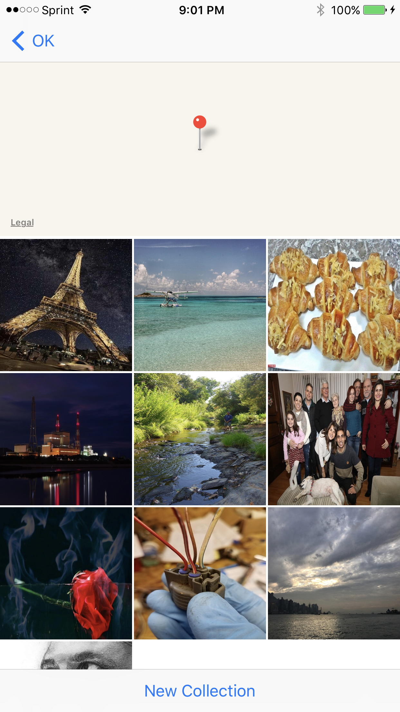

# Virtual-Tourist

### Overview
Swift application that uses the MapKit framework to allow users to drop pins on a world map then recieve images from those pins location via the Flickr Api.

  

### Implementation
2 View Controller Scenes:

* __MapController__- Upon launch you will be presented with a Map View which thanks to core data saves your previous sessions dropped pins. When a pin is tapped user is directed to the Photo Album View while downloading the images realitive to that pins location from Flickr. Pressing and holding users selected location on the map will drop a new pin to retrieve images from. 

* __CollectionController__ - If images are available they will be displayed in a collection view once they have all been downloaded. Tapping the "New Collection" button will empty the photo album and fetch a new set of images. Users are able to remove photos from an album by tapping them. Tapping the back button will return the user to the Map view.

### Requirements
* Xcode 10.0 
* Swift 5.0
